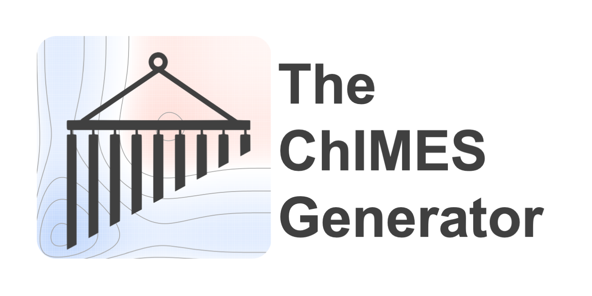

    

Provide an overview here; explain that the "ChIMES Generator" is chimes-lsq

Documentation
----------------

[**Full documentation**](https://chimes-lsq.readthedocs.io/en/latest/) is available.

Community
------------------------

Questions, discussion, and contributions (e.g. bug fixes, documentation, and extensions) are welcome. 

Additional Resources: [ChIMES Google group](https://groups.google.com/g/chimes_software).

Contributing
------------------------

Contributions to the ChIMES generator should be made through a pull request, with ``GH-develop`` as the destination branch. A test suite log file should be attached to the PR. For additional contributing guidelines, see the documentation.

Releases
--------

For most users, we recommend using the ChIMES calculator stable releases.

[stable releases](https://github.com/rk-lindsey/chimes_lsq/releases).

Authors
----------------

The ChIMES generator was developed by Rebecca K. Lindsey, Nir Goldman, and Laurence E Fried.

Contributors can be found [here](https://github.com/rk-lindsey/chimes_lsq/graphs/contributors).

Citing
----------------

See [the documentation](https://chimes-lsq.readthedocs.io/en/latest/citing.html) for guidance on referencing ChIMES and the ChIMES calculator in a publication.

License
----------------

The ChIMES calculator is distributed under terms of 
[LGPL v3.0 License](https://github.com/rk-lindsey/chimes_lsq/blob/main/LICENSE).

LLNL-CODE-835874
